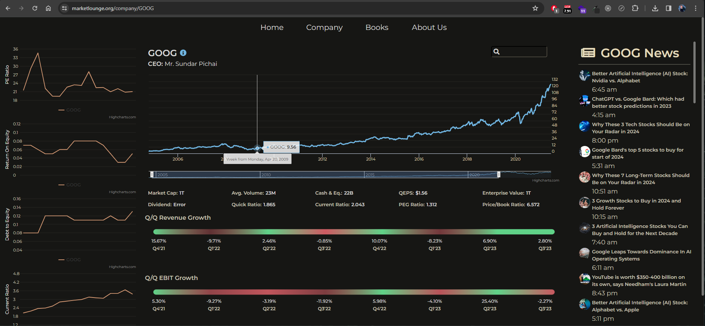

# Market Lounge

Market Lounge is an open source, interactive, data visualization app that helps users identify important financial metrics and trends before investing in public companies.

## Getting started

1. [Clone the repository](https://docs.github.com/en/repositories/creating-and-managing-repositories/cloning-a-repository)
2. Navigate to the cloned project's directory
3. Run `npm start` to host and view the project locally ([http://localhost:3000](http://localhost:3000) by default)
4. Request access to the Jira board [here](https://entremont.atlassian.net/jira/software/c/projects/ML/boards/1/backlog?issueLimit=100&view=detail) where we manage tasks
5. Join the slack channel [here](https://join.slack.com/t/simplemarkets/shared_invite/zt-29lp1xm5v-wImtuUt8j3DvvRm_UzQpwQ) and tell us what you're passionate about in the general channel 😊

## Tech

- React.js
- AWS Amplify
- D3
- Highcharts

## Learn More

Learn more about [React](https://reactjs.org/) and [CRA](https://facebook.github.io/create-react-app/docs/getting-started).

- [Code Splitting](https://facebook.github.io/create-react-app/docs/code-splitting)
- [Analyze bundle size](https://facebook.github.io/create-react-app/docs/analyzing-the-bundle-size)
- [Advanced configuration](https://facebook.github.io/create-react-app/docs/advanced-configuration)

## License

This work is licensed under [CC BY-NC-SA 4.0](./LICENSE)
